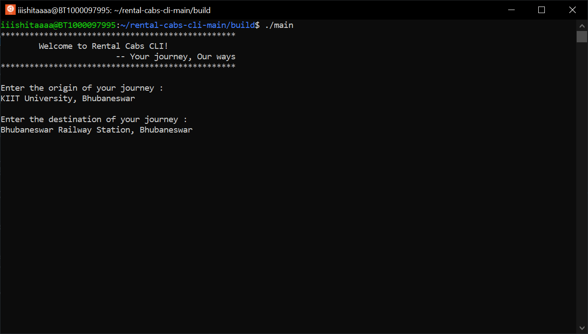
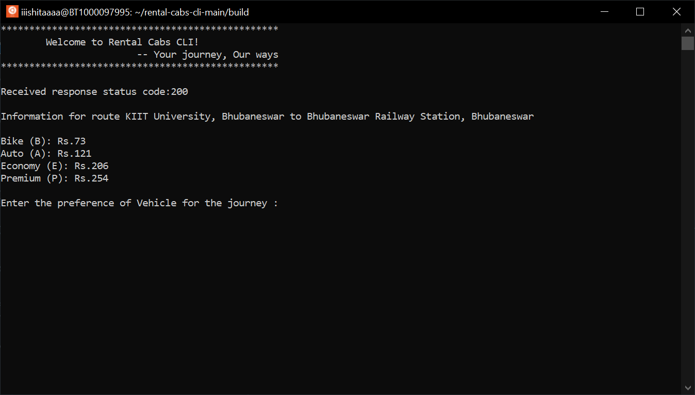
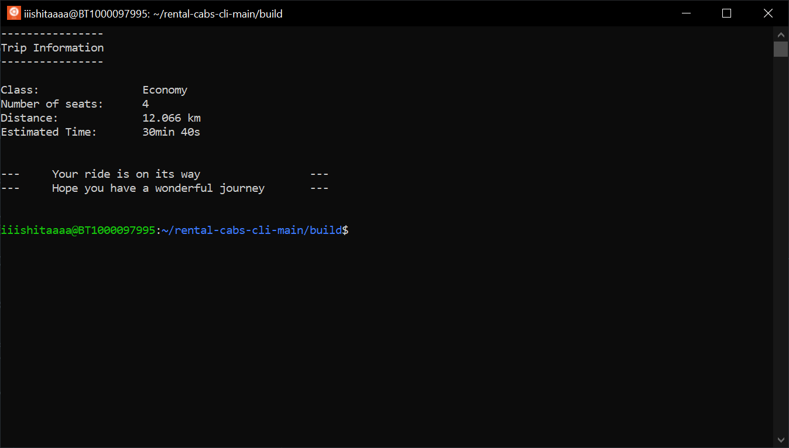

# CLI Clone of Ola/Uber

A CLI Application made using C++ to book rental cabs between locations.

## Screenshots





## Setup Guide

Install CMAKE

```bash
$ sudo apt-get install cmake
```

Install cpprestsdk

```bash
$ sudo apt-get install libcpprest-dev
```

> For installation on platforms other than Ubuntu/Debian, please visit [https://github.com/microsoft/cpprestsdk/](https://github.com/microsoft/cpprestsdk/ "https://github.com/microsoft/cpprestsdk/")

Build using CMAKE

```bash
$ /usr/bin/cmake --build ./build --config Release --target main -j 10 --
```

Run the executable

```bash
$ ./build/main
```
